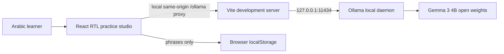

# ميدان | Meydan

**Arabic for the work and life you already know, with English support.**

Meydan is an Arabic-first practice studio for Arabic learners and professionals who can do their work but struggle to explain it in Arabic. It turns a learner's real domain knowledge into guided professional Arabic practice instead of treating Arabic as conversation-only or grammar-only.

## The problem

Many Arabic students, especially learners in non-Arabic-speaking environments, study grammar, morphology, literature, and conversation but have little opportunity to practise explaining their own profession in Arabic. A software engineer may know cloud infrastructure well and still not know how to describe deployment automation to an Arabic-speaking colleague. Meydan gives learners a low-pressure place to practise that transfer.

## Current prototype

- Arabic/English interface with RTL/LTR switching and a persistent light/dark theme.
- Four starting fields: technology, health communication, travel, and international relations.
- Three concrete tasks: write a bilingual piece, learn field terminology, or practise a dialogue.
- Field-specific Arabic-English terminology cards with a local phrasebook.
- Streaming local inference through Ollama; model output renders Markdown tables, headings, and lists.
- Explicit caveat that model output can be wrong; health and other high-stakes advice is out of scope.

This is a weekend prototype. The next validation step is a real handoff to one friend and a short, permission-based summary of their feedback.

## Model choice

The current default is **Gemma 3 4B** (`gemma3:4b`), an open-weight model with multilingual support and an Ollama package around 3.3 GB. It was selected after testing on this CPU-only laptop because it generated more tokens per second than the 9B Fanar quantization and the tested Qwen3 4B Instruct tag. It can still make Arabic and terminology mistakes; the first travel-writing sample was more poetic than requested and one glossary entry was questionable. Never infer Arabic correctness from fluency alone.

Qwen3 4B Instruct is also installed and was measured as an alternative. It ran at about 2.5 generated tokens/second on one 204-token test, but a writing sample contained awkward phrasing and weak terminology. Gemma's measured test generated 371 tokens in about 110 seconds (roughly 4 tokens/second including prompt/model load). The two tests are small and not a controlled benchmark; model behavior varies with prompt, context, quantization, and thermal state. The application uses Gemma by default, streams output so it appears as it is generated, keeps the model warm for ten minutes, and caps context at 4K to control CPU/RAM cost.

Gemma's weights are open weights under Google's Gemma terms, not an Apache-2.0 model. Qwen3 is Apache-2.0. See the official [Gemma documentation](https://ai.google.dev/gemma/docs/core) and [Qwen3-4B card](https://huggingface.co/Qwen/Qwen3-4B). The app does not download weights itself.

## Hardware and measured behavior

Test machine: 12 CPU cores, 32 GB RAM, Intel integrated graphics, no discrete GPU. Gemma 3 4B uses about 3.3 GB on disk; inference is CPU-only. A measured 371-token sample took about 110 seconds end-to-end. Expect a noticeable wait on CPU; streaming shows progress but cannot make inference instantaneous. See [MODEL_EVALUATION.md](./MODEL_EVALUATION.md) for the comparisons and quality defects.

## Run locally

### Requirements

- Node.js 20.19+ or 22.12+
- npm
- Ollama running at `http://127.0.0.1:11434`
- About 6 GB free disk space for this quantized model, plus application dependencies

Install Ollama for your platform from [ollama.com/download](https://ollama.com/download), start its local service, then pull the model:

```bash
ollama pull gemma3:4b
ollama list
```

From this directory:

```bash
npm install
npm run dev
```

Open `http://localhost:5173`. Vite proxies `/ollama/*` to the local Ollama daemon at `127.0.0.1:11434`; the proxy is for local development, not a production public deployment. Keep the daemon bound to localhost. Do not expose it to a public network without an explicit security design.

Production checks:

```bash
npm run lint
npm run build
npm run preview
```

## Privacy and safety

- Conversation requests go to the local Ollama daemon through the local Vite proxy; Meydan does not call a hosted model API.
- The learner-saved phrasebook is stored in this browser's `localStorage` under `meydan-saved-phrases-v3`; the suggested starter terminology is not counted as saved.
- Clearing browser storage removes saved phrases. Current conversation messages are held in page memory and are not persisted.
- The prototype has no accounts, analytics, or server-side conversation store.
- Model output may be linguistically or factually incorrect. Have a qualified speaker review technical terminology before relying on it.
- The health field is communication role-play only. The app must not be used for diagnosis, treatment advice, or other high-stakes decisions.

## Architecture



## Project structure

```text
src/App.tsx       UI, field scenarios, prompts, model call, phrasebook
src/App.css       Responsive product interface
src/index.css     Type, color and global foundations
vite.config.ts    Local Ollama development proxy
MODEL_EVALUATION.md  Manual model test record and evaluation plan
```

## Known limitations and next steps

1. Validate scenario usefulness and feedback with the actual friend this project is for.
2. Have an Arabic language educator review sample answers and domain terminology.
3. Add a small human-reviewed test set across professional fields, code-switching, and the "leave this correct sentence alone" case.
4. Add visible response timing and a cancel/retry control for slower CPU inference.
5. Have an Arabic language educator review starter terms, output, and English translations; test interface switching with learners.
6. Consider an optional, clearly separated hosted deployment only if privacy trade-offs and model access are explained to users.

## Challenge context

Built for the DEV Hacktoberfest Weekend Challenge theme **Build for a Friend**: a new open-AI project to help a real learner practise a real communication need. Submission is a separate DEV article and must be published before the challenge deadline; this repository alone is not an entry.

## Credits

- Google for Gemma 3 open weights and Ollama for local inference; Qwen and Fanar were compared during model selection.
- React, Vite, TypeScript, and Lucide for the application stack and icons.
